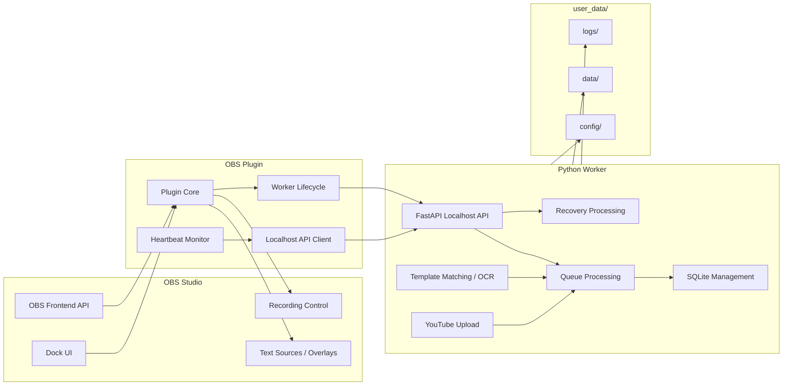

# Plugin Worker Architecture

## Responsibility Separation

| Component | Responsibility |
|---|---|
| OBS Plugin | OBS integration, UI, overlay updates |
| Python Worker | DB, queue, OCR, uploads |

---

## Plugin / Worker Architecture

This diagram shows the responsibility boundary between the lightweight OBS Plugin and the Python Worker.

---

## Plugin Responsibilities

- OBS Frontend API
- Dock UI
- Text Source updates
- Worker process management
- Worker heartbeat monitoring

---

## Worker Responsibilities

- SQLite
- Queue processing
- Recovery
- Template matching
- OCR
- YouTube upload
- Export generation

---

## Communication

Plugin and Worker communicate using localhost HTTP APIs.

For Dock UI behavior and actionable diagnostics, see:
- `docs/architecture/worker-diagnostics.md`

For compatibility gating between the Plugin and Worker, see:
- `docs/architecture/compatibility.md`

For runtime directory rules and startup-safe directory creation, see:
- `docs/architecture/runtime-dirs.md`

For v0.2 Worker logging behavior, see:
- `docs/architecture/worker-logging.md`

For the v0.2 Worker API contract, see:
- `docs/architecture/worker-api.md`

Example:
- GET /health
- POST /events/recording-started
- POST /events/recording-stopped
