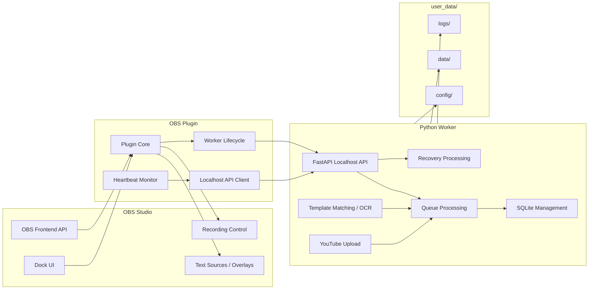

# Plugin Worker Architecture

## Responsibility Separation

| Component | Responsibility |
|---|---|
| OBS Plugin | OBS integration, UI, overlay updates |
| Python Worker | DB, queue, OCR, uploads |

---

## Plugin / Worker Architecture

This diagram shows the responsibility boundary between the lightweight OBS Plugin and the Python Worker.

---

## Plugin Responsibilities

- OBS Frontend API
- Dock UI
- Text Source updates
- Worker process management
- Worker heartbeat monitoring

---

## Worker Responsibilities

- SQLite
- Queue processing
- Recovery
- Template matching
- OCR
- YouTube upload
- Export generation

---

## Worker Launch Contract (v0.4)

This section defines the minimal contract for launching the Worker process from the OBS plugin.

Tracking:
- Child issue: #120
- Parent tracking issue: #110

Related design inputs:
- #126 instance identity and port ownership
- #127 single-instance and port-collision contract
- #144 instance_id adoption decision
- #145 reused-Worker ownership contract

### Ownership

- The Worker is a singleton per `ODR_USER_DATA_DIR` runtime root.
- The OBS plugin owns discovery and use of the singleton Worker for its configured runtime root.
- The plugin should reuse an existing healthy singleton Worker for the same `ODR_USER_DATA_DIR`.
- The plugin should spawn a Worker only when no healthy singleton exists for that runtime root.
- The Worker is responsible for initializing its own runtime dirs and logging under `user_data/`.
- The plugin must avoid spawning multiple Workers for the same `ODR_USER_DATA_DIR`.

### Inputs

The plugin must define these launch inputs deterministically:

- `ODR_USER_DATA_DIR` (required): absolute path to the runtime root directory.
  - The Worker creates subdirectories under this root (`config/`, `data/`, `logs/`).
  - If unset, the Worker defaults to `<repo>/user_data/` (repo-layout dependent).
  - The singleton scope is this resolved runtime root.
- `host` / `port` (recommended): bind address for the localhost HTTP API.
  - Defaults (Worker v0.2 scaffold): `127.0.0.1:8787`.
  - Overrides are supported via CLI: `--host` / `--port`.

Optional:
- `user_data/config/worker.toml` may define `host` / `port` as defaults.

### Recommended Invocation

The plugin should prefer invoking the packaged CLI entrypoint when available:

- `odr-worker --host 127.0.0.1 --port 8787`

If the plugin embeds Python or launches via `python -m`, the command must still behave equivalently and use the same `ODR_USER_DATA_DIR`.

### Startup Handshake

- Before spawning, the plugin should discover whether a healthy singleton Worker already exists for the resolved `ODR_USER_DATA_DIR`.
- After spawning the Worker, the plugin must wait until the API becomes ready.
- Readiness signal: successful response from `GET /health`.
- The plugin should apply a bounded timeout and surface actionable diagnostics when startup fails.

### Single-instance and Port-Collision Handling

The plugin must avoid accidentally talking to the wrong localhost process.

Minimum policy (v0.4):

- Preflight check: before spawning, try `GET /health` on the target `host:port`.
- If `/health` is reachable, compatible, and identifies the same `ODR_USER_DATA_DIR` scope, the plugin should treat it as the already-running singleton Worker and reuse it.
- If `/health` is reachable but is not compatible, or the plugin cannot confirm the same runtime-root singleton scope, treat it as a **launch failure** (port collision / foreign process) and do not continue as "running".
- If the port is in use but `/health` is not reachable or returns invalid responses, treat it as a **launch failure** (stale/unknown process) and do not automatically kill the process.
- If the Worker exposes `instance_id`, the plugin should use it as a diagnostic signal for singleton invariant violations, stale processes, and wrong-port connections. `instance_id` is not the primary ownership gate.

Optional refinement:
- If the Worker implements `GET /version`, the plugin may use it as a lighter preflight (read `version` / `api_version` / `instance_id`) before calling `/health`.

The definition of the intended Worker is the singleton Worker for the resolved `ODR_USER_DATA_DIR`. `instance_id` can help diagnose unexpected process changes, but the runtime-root singleton is the primary contract.

### Handoff to Other v0.4 Concerns

- Heartbeat cadence/timeout and failure handling lives in #121.
- Diagnostics mapping and wrapper behavior for collision cases lives in #123.
- The exact `instance_id` mismatch behavior lives in #144.

### Shutdown Contract

- The plugin must not stop a reused singleton Worker unless ownership rules say it is safe to do so.
- If the plugin spawned the singleton Worker for the current runtime root, it should stop that Worker when OBS is shutting down or when the user explicitly stops it.
- Preferred flow for plugin-owned Workers:
  - graceful terminate with a short timeout, then
  - force kill as a fallback.
- For reused Workers, the plugin should first surface a diagnostic or confirmation path instead of blindly terminating a process that may be shared by another OBS instance.

### Failure Reporting

The plugin should surface at least:

- worker exit code (if available)
- the resolved `ODR_USER_DATA_DIR`
- the Worker log directory (`<ODR_USER_DATA_DIR>/logs/`)
- the API target (`host:port`) used for health checks
- observed `instance_id` when available

---

## Communication

Plugin and Worker communicate using localhost HTTP APIs.

For Dock UI behavior and actionable diagnostics, see:
- `docs/architecture/worker-diagnostics.md`

For compatibility gating between the Plugin and Worker, see:
- `docs/architecture/compatibility.md`

For runtime directory rules and startup-safe directory creation, see:
- `docs/architecture/runtime-dirs.md`

For v0.2 Worker logging behavior, see:
- `docs/architecture/worker-logging.md`

For the v0.2 Worker API contract, see:
- `docs/architecture/worker-api.md`

Example:
- GET /health
- GET /version
- POST /events/recording-started
- POST /events/recording-stopped