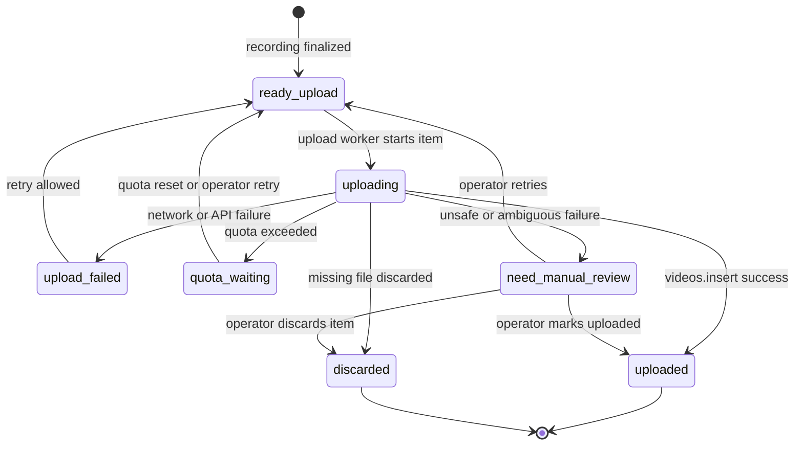

# Queue Design

## Queue Persistence

Queue state must survive:
- OBS restart
- Worker restart
- PC reboot

v0.7 makes the Python Worker the owner of queue recovery state. Queue items are persisted in SQLite and exposed through the localhost Worker API. The OBS Plugin and future upload workers should use that API boundary rather than editing SQLite directly.

---

## Queue State Machine

This diagram shows the upload queue lifecycle owned by the Python Worker.

---

## Queue Item Fields

- `state`: `ready_upload`, `uploading`, `uploaded`, `upload_failed`, `quota_waiting`, `need_manual_review`, or `discarded`
- `video_path`: local runtime video path when known
- `youtube_video_id` and `youtube_url`: success markers from YouTube upload
- `retry_count` and `max_retries`: retry accounting
- `next_attempt_at`: UTC retry/quota wait time when known
- `last_error_code` and `last_error_message`: stable failure diagnostics
- `manual_review_reason`: reason an operator must decide
- `manual_review_evidence`: compact JSON evidence safe to display or export

---

## Recovery Rules

Interrupted recordings are handled by the v0.6 recording lifecycle boundary.

Unuploaded items in `ready_upload`, `upload_failed`, and `quota_waiting` remain persisted and can be resumed in order.

### Restart reconciliation for interrupted `uploading` items

An item left in `uploading` after a restart is ambiguous:

- the upload may have succeeded but the Worker crashed before persisting the success state
- the upload may have failed but the failure was not persisted

Because a blind automatic retry can create duplicate uploads and waste quota, the default rule is **do not auto-retry**.

On startup, reconcile `uploading` items in this order:

1. If the item already has `youtube_video_id`, treat it as `uploaded`.
2. If the item has an absolute local video path and that file is missing, move it to `discarded`.
3. Otherwise move the item to `need_manual_review`.

---

## Manual Adjudication Contract

`need_manual_review` exists to avoid duplicate uploads when the Worker cannot prove whether an upload already reached YouTube.

Minimum persisted evidence:
- queue item id
- previous state
- local `video_path` if known
- retry count
- last error code/message when known
- reason for manual review

Allowed operator actions:
- `retry`: only after the operator decides duplicate upload risk is acceptable.
- `discard`: when the local file is missing, intentionally abandoned, or known not to need upload.
- `mark_uploaded`: only after the operator confirms the upload on YouTube and provides `youtube_video_id`.

The default startup rule for interrupted `uploading` is `need_manual_review`, not automatic retry.

---

## Retry Rules

| Failure Type | Action |
|---|---|
| Network failure | Retry |
| Quota exceeded | Wait for quota reset |
| Missing file | Discard |
| Ambiguous upload state | Manual review |

Network/API failures increment `retry_count`. Once `retry_count` exceeds `max_retries`, the item moves to `need_manual_review`.

Quota failures move to `quota_waiting` with a persisted `next_attempt_at`. The queue can return to `ready_upload` after quota reset or operator retry.
