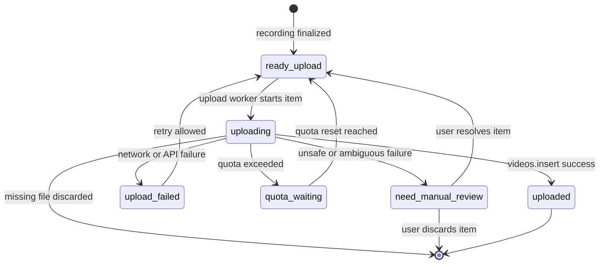

# Queue Design

## Queue Persistence

Queue state must survive:
- OBS restart
- Worker restart
- PC reboot

---

## Queue State Machine

This diagram shows the upload queue lifecycle owned by the Python Worker.

---

## `need_manual_review` Contract (v0.7+)

This section defines the docs-first contract for manual adjudication of queue items
in the `need_manual_review` state.

### Goals

- Avoid duplicate uploads.
- Preserve enough evidence for an operator to decide without re-running blindly.
- Keep the adjudication actions small, explicit, and auditable.

### Minimum persisted evidence

Persist (or be able to reconstruct) at least:

- queue item id (stable)
- local file identity (absolute path + size + mtime; optionally a hash)
- local file existence (whether it still exists)
- last known state + last transition time
- last transition reason (short summary)
- last attempt timestamp
- last attempt summary (error class, short message, and when it occurred)
- retry count
- last error category (coarse; e.g. network/auth/quota/unknown)
- if known/confirmed: remote evidence (video id / URL / uploaded_at)
- operator note (optional; empty by default)

If available, also persist a redacted, short excerpt of the remote API response that led to `need_manual_review`.

### Allowed operator actions

1. Retry
   - Allowed when the local file still exists and the item is not known to be already uploaded.
   - Must reset the item back to `ready_upload` and clear transient error state.
2. Discard
   - Allowed when the operator confirms the local file should not be uploaded.
   - Must record the discard reason (free text) and permanently terminate the item.
3. Mark uploaded
   - Allowed when the operator can confirm the item was already uploaded.
   - Must record the remote identifier (e.g. URL or video id) and permanently terminate the item.

### Core principle

Avoid duplicate uploads: when remote existence is unknown, prefer keeping the item in
`need_manual_review` until the operator can confirm (or safely discard) it.

---

## Recovery Rules

Interrupted recordings are discarded.

Unuploaded items (`ready_upload`, `upload_failed`, `quota_waiting`) are resumed in order.

### Restart reconciliation for interrupted `uploading` items

An item left in `uploading` after a restart is ambiguous:

- the upload may have succeeded but the Worker crashed before persisting the success state
- the upload may have failed but the failure was not persisted

Because a blind automatic retry can create duplicate uploads and waste quota, the default rule is **do not auto-retry**.

On startup, reconcile `uploading` items in this order:

1. If the item already has `youtube_video_id` (or equivalent success marker), treat it as `uploaded`.
2. If the local video file is missing, discard the item.
3. Otherwise move the item to `need_manual_review`.

`need_manual_review` should offer the user a safe choice:

- Retry: `need_manual_review` -> `ready_upload`
- Discard: `need_manual_review` -> dropped (terminal; no retry)
- (Future) Mark as uploaded by attaching `youtube_video_id` after a manual channel check

Manual adjudication evidence and allowed operator actions are defined above in `need_manual_review` Contract (v0.7+).

---

## Retry Rules

| Failure Type | Action |
|---|---|
| Network failure | Retry |
| Quota exceeded | Wait for quota reset |
| Missing file | Discard |
