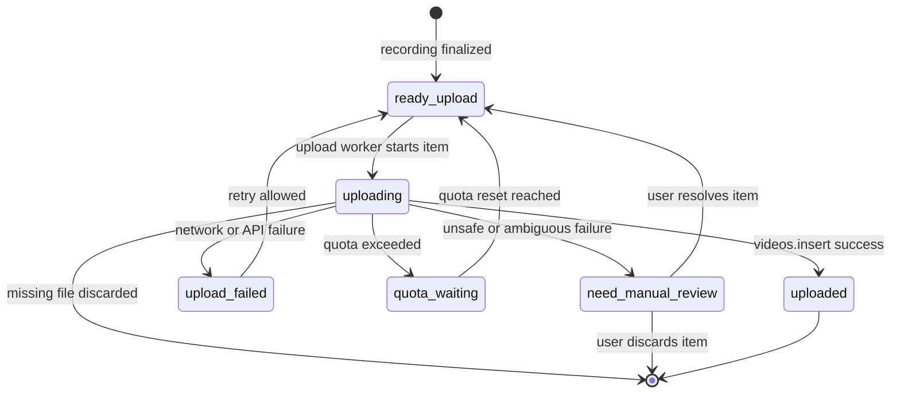

# Queue Design

## Queue Persistence

Queue state must survive:
- OBS restart
- Worker restart
- PC reboot

---

## Queue State Machine

This diagram shows the upload queue lifecycle owned by the Python Worker.

---

## Recovery Rules

Interrupted recordings are discarded.

Unuploaded items are resumed in order.

---

## Retry Rules

| Failure Type | Action |
|---|---|
| Network failure | Retry |
| Quota exceeded | Wait for quota reset |
| Missing file | Discard |
