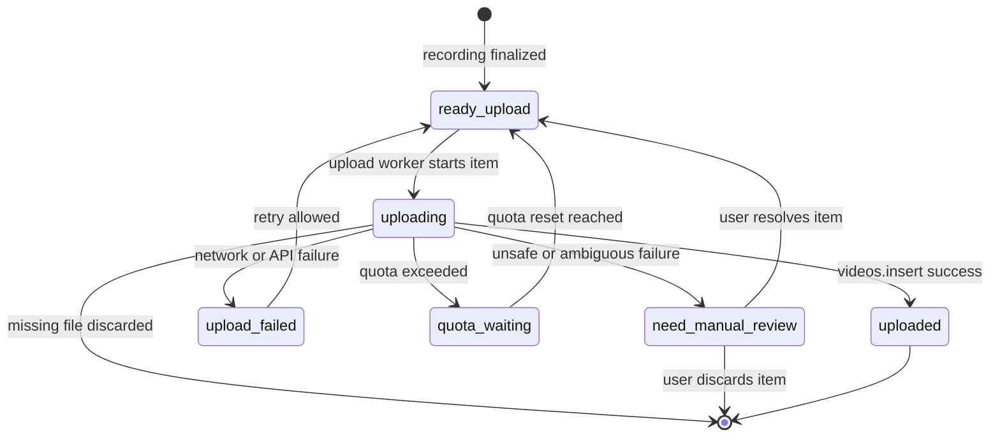

# Queue Design

## Queue Persistence

Queue state must survive:
- OBS restart
- Worker restart
- PC reboot

---

## Queue State Machine

This diagram shows the upload queue lifecycle owned by the Python Worker.

---

## Recovery Rules

Interrupted recordings are discarded.

Unuploaded items (`ready_upload`, `upload_failed`, `quota_waiting`) are resumed in order.

### Restart reconciliation for interrupted `uploading` items

An item left in `uploading` after a restart is ambiguous:

- the upload may have succeeded but the Worker crashed before persisting the success state
- the upload may have failed but the failure was not persisted

Because a blind automatic retry can create duplicate uploads and waste quota, the default rule is **do not auto-retry**.

On startup, reconcile `uploading` items in this order:

1. If the item already has `youtube_video_id` (or equivalent success marker), treat it as `uploaded`.
2. If the local video file is missing, discard the item.
3. Otherwise move the item to `need_manual_review`.

`need_manual_review` should offer the user a safe choice:

- Retry: `need_manual_review` → `ready_upload`
- Discard: `need_manual_review` → discard
- (Future) Mark as uploaded by attaching `youtube_video_id` after a manual channel check

---

## Retry Rules

| Failure Type | Action |
|---|---|
| Network failure | Retry |
| Quota exceeded | Wait for quota reset |
| Missing file | Discard |
