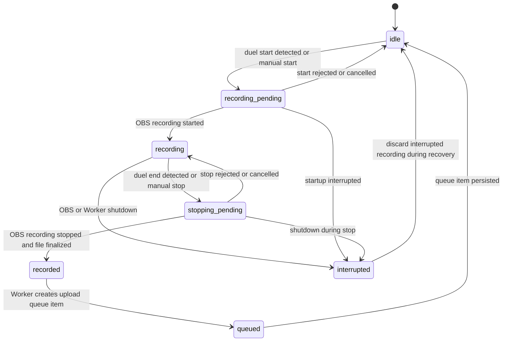

# Recording State Machine

Recording lifecycle coordination is split between the OBS Plugin and the Python Worker.

The OBS Plugin owns OBS recording control and lifecycle events.

The Python Worker owns queue creation, recovery decisions, and persistent runtime state.

## Notes

- OCR must not be the primary recording trigger mechanism.
- Interrupted recording sessions should be discarded during recovery.
- Queue persistence is handled by the Python Worker, not the OBS Plugin.
