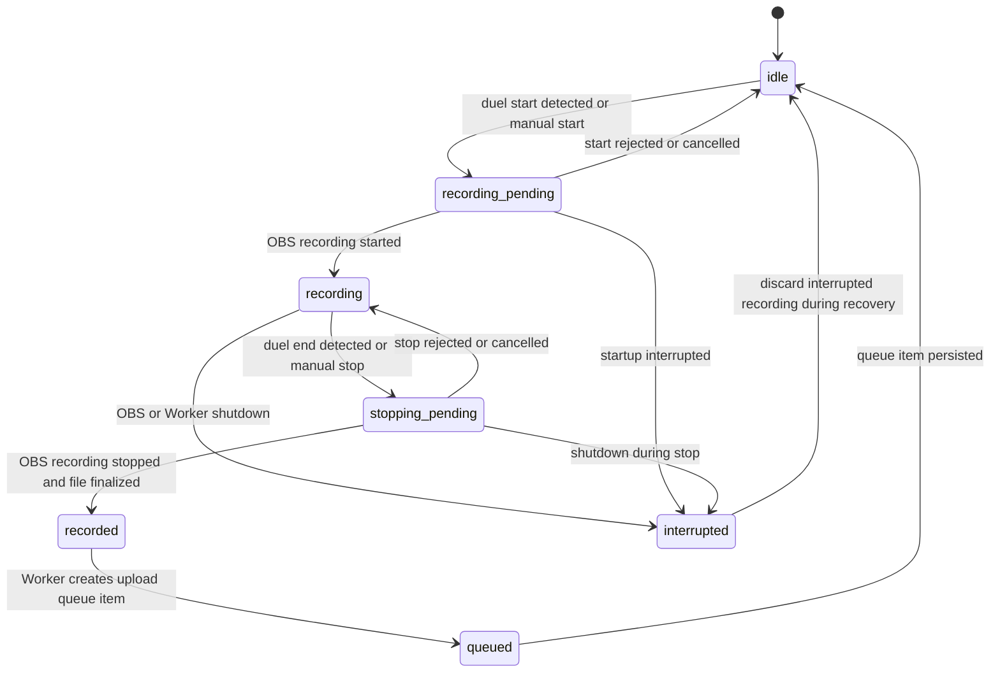

# Recording State Machine

Recording lifecycle coordination is split between the OBS Plugin and the Python Worker.

The OBS Plugin owns OBS recording control and lifecycle events.

The Python Worker owns queue creation, recovery decisions, and persistent runtime state.

v0.6 makes the Worker the authoritative owner of recording lifecycle state while the OBS Plugin remains the owner of OBS recording start/stop calls.

## Notes

- OCR must not be the primary recording trigger mechanism.
- Interrupted recording sessions should be discarded during recovery.
- Queue persistence is handled by the Python Worker, not the OBS Plugin.

## v0.6 State Contract

The v0.6 recording state contract is intentionally small and explicit.

| State | Meaning |
|---|---|
| `idle` | No active recording session exists. |
| `starting` | A manual or automatic command requested OBS recording start, but OBS has not confirmed active recording yet. |
| `recording` | OBS recording is active for the current session. |
| `stopping` | A stop command was accepted, but OBS has not confirmed final stop yet. |
| `completed` | OBS stopped and the session can be handed to future queue creation. |
| `interrupted` | Startup/restart found an in-progress session that must be discarded or recovered. |
| `error` | The lifecycle entered a diagnosable failure state. |

Allowed command sources:

- `manual`: operator action from the Plugin/Dock or localhost API.
- `automatic`: future detector action. v0.6 defines the shared boundary but does not implement v0.8 detection.
- `recovery`: startup/restart recovery action.

Allowed command actions:

- `start`
- `confirm_started`
- `stop`
- `confirm_stopped`
- `mark_interrupted`
- `discard_interrupted`
- `reset`

Invalid transitions must be rejected with a stable diagnostic. They must not silently mutate state.

## v0.6 API Boundary

The Worker exposes the authoritative state through localhost API routes:

- `GET /recording/state`
- `POST /recording/command`

The Plugin should use this boundary for manual controls and OBS event synchronization. The v0.5 overlay `recording_state` display may mirror this state, but overlay display remains a consumer and not the owner.

For v1.1 recording output evidence, the Plugin should use OBS Frontend API
recording path helpers instead of parsing OBS logs:

- `obs_frontend_get_current_record_output_path()` when recording starts, as
  best available in-progress output evidence.
- `obs_frontend_get_last_recording()` when OBS reports recording fully stopped,
  as the completed output path.

If OBS does not return a completed path, the Dock should keep the best prior
output evidence and explicitly tell the user to check OBS Output settings and
OBS logs.

## Recovery Rules

On startup, in-progress states are treated as interrupted:

- `starting`
- `recording`
- `stopping`

Recovery should move interrupted state to a documented discard/recovery outcome without deleting unrelated runtime files. Future versions may add queue handoff or media cleanup, but v0.6 must keep the behavior diagnosable and restart-safe.
