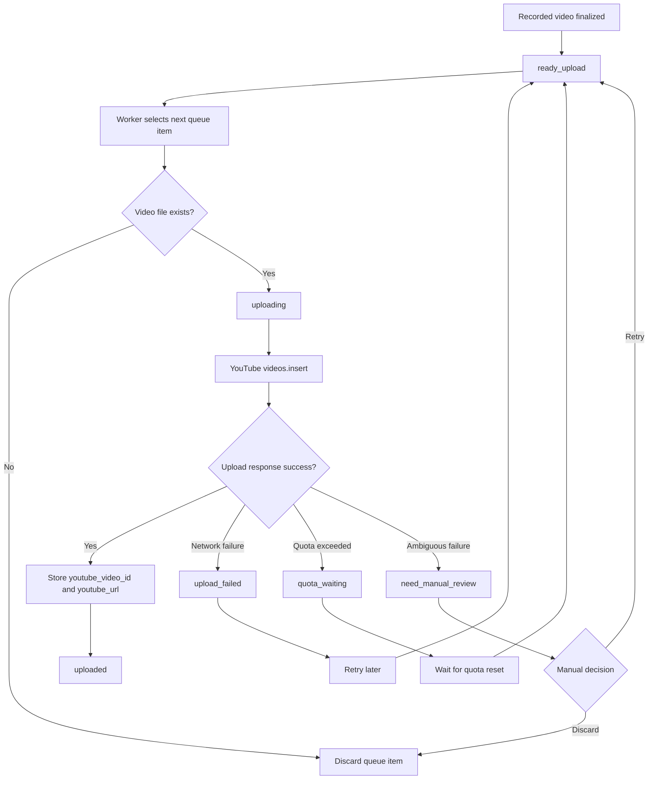

# Upload Flow

## Upload Sequence

recorded
-> ready_upload
-> uploading
-> uploaded

---

## Upload Flow Diagram

This diagram shows the Worker-owned upload flow and how upload outcomes map back to queue states.

---

## Upload Success

Upload success is determined by:
- videos.insert response
- youtube_video_id generation

---

## Upload Failure

Network failures:
- retry later

Quota exceeded:
- move to quota_waiting

Missing files:
- discard queue entry

---

## Restart-safe behavior for `uploading`

If the Worker crashes or the PC restarts while a queue item is in `uploading`, the upload outcome may be unknown.

To avoid duplicate uploads and quota waste, the recommended default is:

- do not automatically retry `uploading` items on startup
- reconcile them into `need_manual_review` unless success can be proven (e.g. persisted `youtube_video_id`)

See also: `docs/architecture/queue.md` → “Restart reconciliation for interrupted `uploading` items”.
