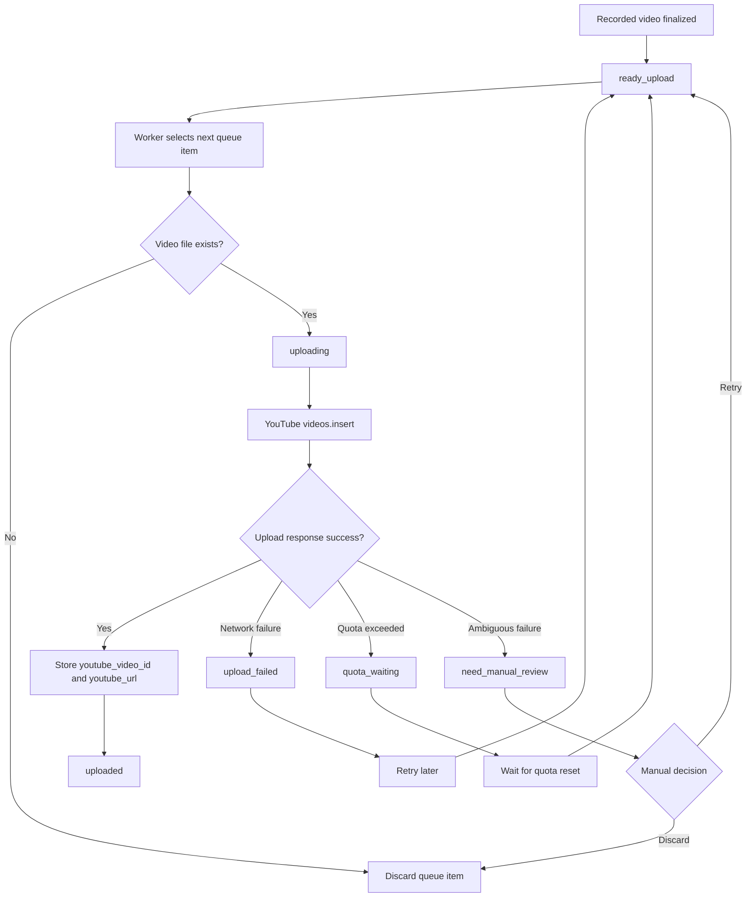

# Upload Flow

v1.0 introduces a Worker-owned upload execution boundary. The v1.0 implementation is deterministic and mockable so upload state transitions can be tested without committing credentials or requiring a real YouTube account in CI.

---

## OAuth And Secret Contract

The only OAuth scope permitted for upload is:

```text
https://www.googleapis.com/auth/youtube.upload
```

Secrets are runtime data:

- client secret file: `user_data/config/secrets/youtube-client-secret.json`
- token file: `user_data/config/secrets/youtube-token.json`

The Worker may report whether those files exist, but it must not return token or client-secret values through status, logs, diagnostics, or test evidence.

Default privacy is `private`. `unlisted` is allowed only by explicit setting.
`public` is not part of the v1.1.4 path and must not be introduced without a
separate explicit issue.

The mock provider remains the default for tests/smoke. v1.1 adds an optional
Google provider that is used only when requested and when runtime credentials
and optional Google client libraries are available.

OAuth setup is Worker-owned and stores tokens only under
`user_data/config/secrets/`:

- `POST /upload/oauth/authorization-url` returns a Google authorization URL.
- `GET /upload/oauth/callback` or `POST /upload/oauth/exchange-code` exchanges
  an authorization code and writes `youtube-token.json`.
- `POST /upload/oauth/refresh` refreshes an existing token when the optional
  Google auth dependencies and refresh token are available.

---

## Upload Sequence

recorded
-> ready_upload
-> uploading
-> uploaded

---

## Upload Flow Diagram

This diagram shows the Worker-owned upload flow and how upload outcomes map back to queue states.



---

## Upload Success

Upload success is determined by:
- a successful `videos.insert`-style response from the upload boundary
- `youtube_video_id` persistence
- `youtube_url` persistence or deterministic derivation from the video id

---

## Upload Failure

Network failures:
- retry later

Quota exceeded:
- move to quota_waiting
- do not repeatedly retry while quota is exhausted
- keep `next_attempt_at` empty unless a reliable reset time is known

Missing files:
- discard queue entry

Ambiguous outcomes:
- move to `need_manual_review`
- preserve redacted evidence for manual retry/discard/mark-uploaded decisions

---

## Quota Policy

The Google provider uses YouTube Data API `videos.insert`. As of the official
YouTube quota-cost page last updated 2026-04-28, the page summary says
`videos.insert` is one of the highest-cost methods at 1600 quota units, and the
same page states that daily quotas reset at midnight Pacific Time (PT):

- <https://developers.google.com/youtube/v3/determine_quota_cost>

The Worker classifies these quota/limit signals as `quota_waiting`:

- `quotaExceeded`
- `dailyLimitExceeded`
- `userRateLimitExceeded`
- HTTP `429`

The official YouTube and Google API error references define `quotaExceeded` and
the global daily/user limit errors:

- <https://developers.google.com/youtube/v3/docs/errors>
- <https://developers.google.com/youtube/v3/docs/core_errors>

`next_attempt_at` remains operator/provider supplied. The Worker does not invent
a reset timestamp when the Google response does not include one. The UI should
present quota waiting as a distinct state from network failure or auth failure,
and should discourage immediate repeated retry because failed or invalid API
requests can also consume quota.

---

## Upload Metadata And Privacy Contract

The preview endpoint and real upload path use the same Worker-rendered metadata
fields:

- `deck_name`
- `opponent_deck`
- `result`
- `rank`
- `dp`
- `title`
- `description`
- `tags`
- `missing_fields`
- `warning`
- `privacy_status`

The Google provider sends those rendered `title`, `description`, and `tags` to
`videos.insert` with `status.privacyStatus`. The preview dialog must show
`privacy_status` before upload so the operator can confirm that the upload is
`private` or explicitly `unlisted`.

Upload execution is blocked when required match metadata is missing. The
required fields for the current Dock upload UX are `deck_name`,
`opponent_deck`, `result`, `rank`, and `dp`. The Worker returns
`metadata_confirmed`, `metadata_missing_fields`, and target-level
`blocking_reasons` so the Plugin can disable the primary upload action and show
the operator what must be fixed before upload.

---

## Worker API

### `GET /upload/status`

Returns:

- OAuth scope
- configured privacy default
- whether token/client-secret files exist
- auth readiness, token state, expiration flag, and refresh availability without
  returning token contents
- `readiness`, `readiness_state`, and `readiness_next_action` for Plugin/UI use
- queue counts by upload state
- available manual actions

Secret values are never returned.

The stable readiness states are:

| State | Meaning | Typical next action |
|---|---|---|
| `ready` | Google upload dependencies, OAuth client secret, token, and queue state are usable. | Upload can proceed. |
| `client_secret_missing` | `youtube-client-secret.json` is not present. | Use the Dock auth-file selection action, or place the client secret under `user_data/config/secrets/`. |
| `token_missing` | `youtube-token.json` is not present. | Run OAuth authorization. |
| `token_invalid` | Token JSON is invalid, expired without refresh, or lacks an access token. | Reauthorize and replace the token. |
| `token_expired_refreshable` | Token is expired but has a refresh token. | Run token refresh. |
| `dependencies_missing` | Optional Google upload/OAuth libraries are unavailable. | Install/bundle Google upload dependencies. |
| `quota_waiting` | One or more queue items are waiting for quota reset. | Wait for reset before retry. |
| `manual_review_required` | One or more queue items need manual review. | Review before retry/discard/mark-uploaded. |

`readiness_state` is duplicated at the top level as a compact field for the OBS
Plugin, while `readiness` retains detailed sub-states:

- `auth_state`
- `provider_state`
- `queue_state`
- `google_dependencies_available`
- queue counts relevant to readiness

### `POST /upload/process-next`

Selects the lowest-id `ready_upload` item and processes it through the upload boundary.

For v1.0 tests and smoke, the request accepts deterministic mock outcomes:

```json
{"mock_result": "success", "youtube_video_id": "abc123"}
```

Supported mock outcomes:

- `success`
- `network_error`
- `quota_exceeded`
- `ambiguous_error`
- `auth_error`

For production upload, select the optional Google provider:

```json
{"provider": "google"}
```

The Google provider calls YouTube `videos.insert`. Missing OAuth files, missing
optional dependencies, auth failures, quota failures, network failures, and
ambiguous outcomes are mapped back to stable queue states.

### `GET /upload/items`

Returns UI-ready upload targets for the Dock Upload tab. Items are sorted with
active work first and uploaded/discarded history last:

1. `ready_upload`
2. `upload_failed`
3. `need_manual_review`
4. `quota_waiting`
5. `uploading`
6. `uploaded`
7. `discarded`

Each target includes compact queue identity, state, video existence, rendered
upload metadata, `metadata_confirmed`, `metadata_missing_fields`,
`blocking_reasons`, and `can_upload`.

### `GET /upload/targets/next`

Returns the first non-terminal upload target after applying the same UI sort.
This endpoint is kept for simple Dock summaries. The full Upload tab should use
`GET /upload/items` so the operator can choose the exact queue item.

### `POST /upload/items/{item_id}/process`

Processes the selected queue item through the same upload boundary as
`POST /upload/process-next`. The endpoint exists so the Dock never uploads a
different item from the one shown in the selected target preview.

### `POST /upload/oauth/authorization-url`

Creates a Google authorization URL from the local client secret file. The
response includes the URL, state, redirect URI, OAuth scope, and token path, but
never includes client-secret contents.

### `GET /upload/oauth/callback`

Receives the browser redirect with `code` and writes the exchanged token to
`user_data/config/secrets/youtube-token.json`.

### `POST /upload/oauth/exchange-code`

Manual code exchange path for tools that cannot use the browser callback.

### `POST /upload/oauth/refresh`

Refreshes an existing token and rewrites `youtube-token.json`. Missing optional
dependencies, missing token files, missing refresh tokens, and refresh failures
return stable OAuth error codes without returning secret values.

Manual review actions remain on the queue command API:

- `retry`
- `discard`
- `mark_uploaded`

`mark_uploaded` requires a plain YouTube video ID. It rejects empty values and
obvious URL/pasted-text mistakes. The stored URL is deterministic:
`https://youtu.be/{youtube_video_id}` unless an explicit URL is supplied by a
trusted upload boundary.

---

## Restart-safe behavior for `uploading`

If the Worker crashes or the PC restarts while a queue item is in `uploading`, the upload outcome may be unknown.

To avoid duplicate uploads and quota waste, the recommended default is:

- do not automatically retry `uploading` items on startup
- reconcile them into `need_manual_review` unless success can be proven (e.g. persisted `youtube_video_id`)

See also: `docs/architecture/queue.md` → “Restart reconciliation for interrupted `uploading` items”.
