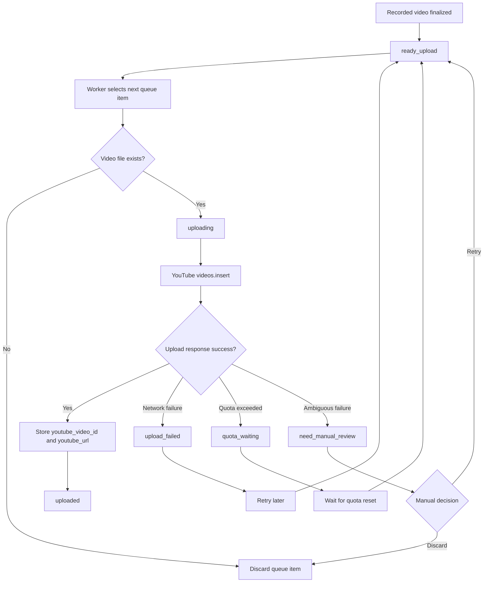

# Upload Flow

v1.0 introduces a Worker-owned upload execution boundary. The v1.0 implementation is deterministic and mockable so upload state transitions can be tested without committing credentials or requiring a real YouTube account in CI.

---

## OAuth And Secret Contract

The only OAuth scope permitted for upload is:

```text
https://www.googleapis.com/auth/youtube.upload
```

Secrets are runtime data:

- client secret file: `user_data/config/secrets/youtube-client-secret.json`
- token file: `user_data/config/secrets/youtube-token.json`

The Worker may report whether those files exist, but it must not return token or client-secret values through status, logs, diagnostics, or test evidence.

Default privacy is `private`. `unlisted` is allowed only by explicit setting. `public` is not part of the default v1.0 path.

v1.0 does not add a Google API dependency. The Worker exposes the upload orchestration boundary and a deterministic local uploader for tests/smoke. A later PR can replace that boundary with a real `videos.insert` client without changing queue semantics.

---

## Upload Sequence

recorded
-> ready_upload
-> uploading
-> uploaded

---

## Upload Flow Diagram

This diagram shows the Worker-owned upload flow and how upload outcomes map back to queue states.



---

## Upload Success

Upload success is determined by:
- a successful `videos.insert`-style response from the upload boundary
- `youtube_video_id` persistence
- `youtube_url` persistence or deterministic derivation from the video id

---

## Upload Failure

Network failures:
- retry later

Quota exceeded:
- move to quota_waiting

Missing files:
- discard queue entry

Ambiguous outcomes:
- move to `need_manual_review`
- preserve redacted evidence for manual retry/discard/mark-uploaded decisions

---

## Worker API

### `GET /upload/status`

Returns:

- OAuth scope
- configured privacy default
- whether token/client-secret files exist
- queue counts by upload state
- available manual actions

Secret values are never returned.

### `POST /upload/process-next`

Selects the lowest-id `ready_upload` item and processes it through the upload boundary.

For v1.0 tests and smoke, the request accepts deterministic mock outcomes:

```json
{"mock_result": "success", "youtube_video_id": "abc123"}
```

Supported mock outcomes:

- `success`
- `network_error`
- `quota_exceeded`
- `ambiguous_error`
- `auth_error`

Manual review actions remain on the queue command API:

- `retry`
- `discard`
- `mark_uploaded`

---

## Restart-safe behavior for `uploading`

If the Worker crashes or the PC restarts while a queue item is in `uploading`, the upload outcome may be unknown.

To avoid duplicate uploads and quota waste, the recommended default is:

- do not automatically retry `uploading` items on startup
- reconcile them into `need_manual_review` unless success can be proven (e.g. persisted `youtube_video_id`)

See also: `docs/architecture/queue.md` → “Restart reconciliation for interrupted `uploading` items”.
