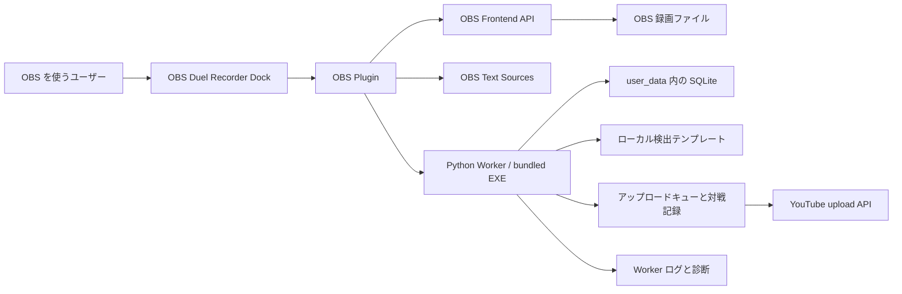

# 操作フローとシステム概要

ステータス注記: このページは v1.1.1 の目標フローを説明します。実際に利用可能な手順は、最新のリリースノートまたは [Roadmap](../../roadmap.md) でリリース済みと示された範囲を確認してください。

このページは、配布 ZIP を展開して OBS Studio に Plugin を入れる通常ユーザー向けです。

## システム概要

責任分担:
- OBS Plugin は Dock UI、OBS 連携、Text Source 更新、Worker 起動、Worker ヘルスチェック、録画 Start/Stop の橋渡しを担当します。
- Worker は SQLite データ、テンプレート検出、対戦記録、アップロードキュー、メタデータ生成、OAuth/token ファイル、YouTube アップロードを担当します。
- OBS は実際の録画エンジンと録画ファイルの出力先を担当します。
- ユーザーデータは `user_data/` または設定済みの実行時データディレクトリに置き、リリース ZIP へ含めません。

## 通常の操作フロー

1. パッケージをインストールまたは更新します。
   - リリース ZIP をダウンロードし、OBS のインストール先とは別の場所に展開します。
   - `install.bat "<OBS install path>"` を実行します。
   - 配置に不安がある場合は `verify-install.bat "<OBS install path>"` を実行します。

2. OBS を起動して Dock を確認します。
   - OBS Studio x64 を開きます。
   - OBS Duel Recorder Dock が表示されることを確認します。
   - Start、Stop、setup、metadata、upload 操作の前に Worker status が running になることを確認します。

3. 初回セットアップを完了します。
   - Dock から Settings または first-run setup を開きます。
   - 実行時データディレクトリを確認します。
   - OBS 連携と overlay/Text Source の動作を確認します。
   - 実アップロードが必要な場合だけ YouTube OAuth を設定します。
   - start/end 検出テンプレートは、自分で作成したローカルファイルから登録します。

4. 必要に応じて手動録画します。
   - Dock の Start と Stop を使います。
   - Plugin がその操作を OBS 録画へ橋渡しします。
   - 録画完了後、Worker が対戦記録とキュー情報を作成または更新します。
   - Dock には直近の録画結果と確認可能な出力情報が表示されます。

5. 自動録画を準備します。
   - start と end のテンプレートを登録します。
   - 自動録画を有効にする前にテンプレート検出テストを実行します。
   - threshold と confirmation count を確認します。
   - 必要なテンプレートが不足している場合、自動録画は無効または未完了として見える必要があります。

6. 対戦メタデータを確認します。
   - Dock の流れから完了済み対戦を開きます。
   - deck、opponent、result、memo などを編集します。
   - 認識結果は候補です。ユーザー確認なしにメタデータを自動上書きしません。

7. アップロードメタデータとキューを確認します。
   - 生成された title と description をプレビューします。
   - 実際の YouTube アップロード前に upload readiness を確認します。
   - 失敗時や確認が必要な場合は retry または manual-review controls を使います。

8. まず Dock からトラブルシュートします。
   - Worker status と launch diagnostics を確認します。
   - runtime、OBS integration、OAuth、template の不足は setup validation で確認します。
   - Dock と setup validation で原因が分からない場合にログを確認します。

## 自動処理とユーザー確認

| 動作 | 自動 | ユーザー確認 |
|---|---:|---:|
| Plugin 設定からの Worker 起動 | はい | 設定パスの修正が必要な場合あり |
| Worker ヘルスチェック | はい | いいえ |
| OBS Text Source の作成または再利用 | 有効時ははい | OBS 上で配置や見た目を調整 |
| 手動録画 Start/Stop | いいえ | はい |
| 自動録画トリガー | テンプレート設定後ははい | 先にテンプレート登録とテストが必要 |
| 対戦記録とキューへの引き渡し | 録画完了後ははい | メタデータ確認が必要 |
| 認識メタデータ候補 | 候補生成ははい | 採用・編集はユーザー判断 |
| YouTube アップロード | 実公開は自動前提にしない | OAuth 設定と確認が必要 |

## 安全なデータの扱い

- OAuth ファイル、client secrets、スクリーンショット、動画、ローカルテンプレート、ゲーム資産を文書やリリースパッケージに含めないでください。
- 通常利用では生成済み SQLite ファイルを手作業で編集しないでください。
- 設定ファイルを直接編集する前に、Dock と setup validation を使ってください。
- ローカルテンプレートは自分の環境にだけ置いてください。このプロジェクトは Yu-Gi-Oh! Master Duel の資産を配布しません。

## 関連ページ

- [インストール](install.md)
- [初回セットアップ](first-setup.md)
- [UI 画像](ui-images.md)
- [Plugin が使う OBS Sources](obs-sources.md)
- [使い方](usage.md)
- [トラブルシューティング](troubleshooting.md)
