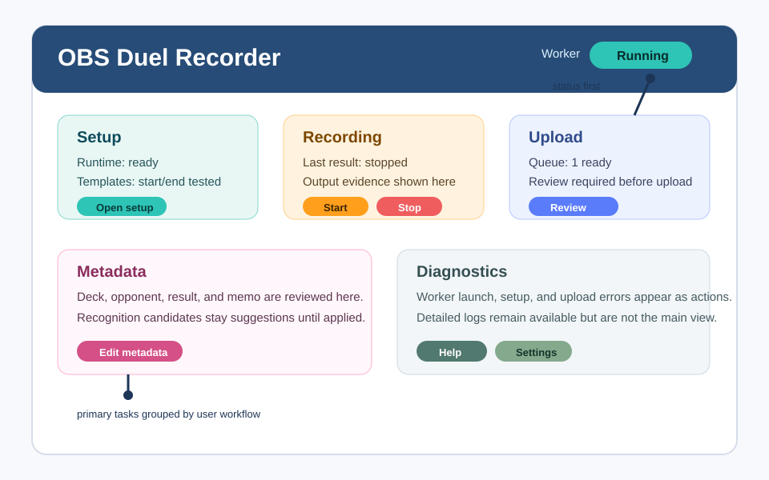
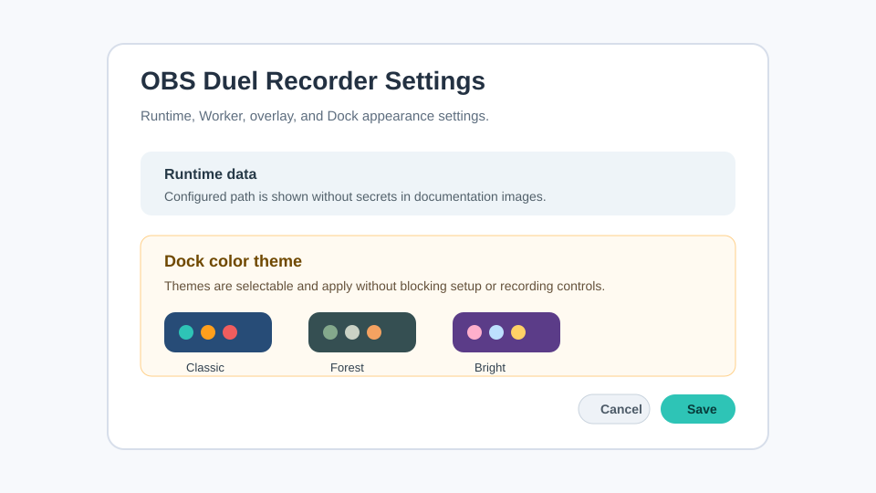
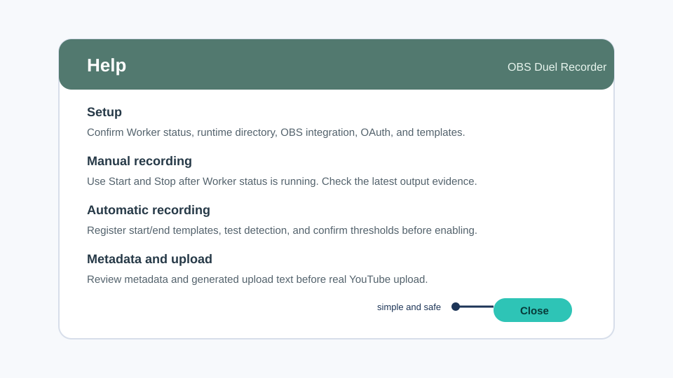

# UI 画像

ステータス注記: このページの画像は v1.1.1 目標 UI のドキュメント用画像です。最終リリース検証では、安全に編集済みの実スクリーンショットへ置き換える場合があります。

このページの画像は、意図的に生成したドキュメント資産です。ローカルパス、OAuth データ、スクリーンショット、動画、テンプレート、ゲーム資産は含みません。

## Dock メインビュー

Dock 画像は v1.1.1 の情報階層を示します。
- status と Worker readiness を最初に見せます。
- setup、recording、upload、metadata、diagnostics を作業ごとにまとめます。
- raw debug text を主画面にしすぎず、必要な診断は見られるようにします。
- Settings と Help を Dock から開けるようにします。

## Settings とテーマ選択

Settings 画像はテーマ選択の目標動作を示します。テーマ選択は分かりやすく変更できる必要がありますが、runtime path、Worker、overlay、recording、metadata、upload の設定を妨げてはいけません。

## Help メッセージ

Help 画像は Dock から開ける簡易 Help の対象範囲を示します。setup、manual recording、automatic recording、metadata review、upload review、diagnostics を短く確認できる想定です。

## 画像を置き換える場合の安全ルール

- ドキュメント用に生成した安全な画像、または編集済みスクリーンショットだけを使います。
- ゲーム画面、個人のファイルパス、OAuth データ、token、動画、スクリーンショット、ローカルテンプレート、ログを写さないでください。
- #450 を閉じる前に、v1.1.1 の Dock、Settings theme、Help 実装と画像が一致していることを確認してください。
