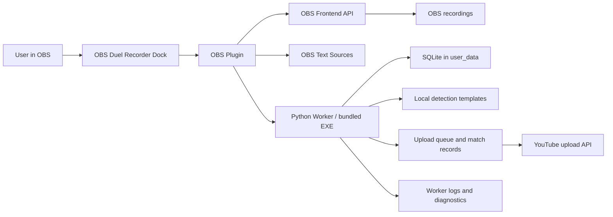

# Operation Flow And System Overview

Status contract: This page describes the v1.1.1 target flow. Treat a step as currently available only when the latest release notes or the [Roadmap](../roadmap.md) mark its version as released.

This page is written for packaged ZIP users who install the Plugin into OBS Studio and use the OBS Duel Recorder Dock.

## System Overview

Responsibility boundary:
- The OBS Plugin owns the Dock UI, OBS integration, Text Source updates, Worker launch, Worker health checks, and recording Start/Stop bridge.
- The Worker owns SQLite data, template detection, match records, upload queue processing, metadata generation, OAuth/token files, and YouTube upload.
- OBS owns the actual video recording output path and recording engine.
- User data stays under `user_data/` or the configured runtime directory and must not be packaged into release ZIPs.

## Normal Operation Flow

1. Install or update the package.
   - Download the release ZIP and extract it outside the OBS installation folder.
   - Run `install.bat "<OBS install path>"`.
   - Run `verify-install.bat "<OBS install path>"` if placement is uncertain.

2. Start OBS and confirm the Dock.
   - Open OBS Studio x64.
   - Confirm that the OBS Duel Recorder Dock appears.
   - Confirm Worker status becomes running before using Start, Stop, setup, metadata, or upload actions.

3. Complete first setup.
   - Open Settings or first-run setup from the Dock.
   - Confirm the runtime data directory.
   - Confirm OBS integration and overlay/Text Source behavior.
   - Configure YouTube OAuth only if real upload is needed.
   - Register local start/end detection templates only from files you created locally.

4. Record manually when needed.
   - Use Start and Stop from the Dock.
   - The Plugin bridges those actions to OBS recording.
   - The Worker records match and queue information after recording completion.
   - The Dock shows the latest recording result and best available output evidence.

5. Prepare automatic recording.
   - Register start and end templates.
   - Run template detection tests before enabling automatic recording.
   - Confirm threshold and confirmation count.
   - Automatic recording should remain disabled or visibly incomplete when required templates are missing.

6. Review match metadata.
   - Open the completed match from the Dock flow.
   - Edit deck, opponent, result, memo, and related fields.
   - Recognition results are suggestions. They must not overwrite user-reviewed metadata automatically.

7. Review upload metadata and queue.
   - Preview the generated title and description.
   - Confirm upload readiness before real YouTube upload.
   - Use retry or manual-review controls when upload fails or needs confirmation.

8. Troubleshoot from the Dock first.
   - Check Worker status and launch diagnostics.
   - Use setup validation for missing runtime, OBS integration, OAuth, or template steps.
   - Use logs only after the Dock and setup validation do not explain the issue.

## Automatic vs User-Confirmed Actions

| Behavior | Automatic | User confirmation expected |
|---|---:|---:|
| Worker launch from Plugin settings | Yes | Settings path may need user correction |
| Worker health polling | Yes | No |
| OBS Text Source create/reuse | Yes, when enabled | User can place and style sources in OBS |
| Manual recording Start/Stop | No | Yes |
| Automatic recording trigger | Yes, after templates and thresholds are configured | User must register and test templates first |
| Match record and queue handoff | Yes after completed recording | User reviews metadata |
| Recognition metadata candidates | Yes as suggestions | User decides whether to apply or edit |
| YouTube upload | No for real publication | User must configure OAuth and approve/review upload path |

## Safe Data Rules

- Do not put OAuth files, client secrets, screenshots, videos, local templates, or game assets into documentation or release packages.
- Do not edit generated SQLite files by hand during normal use.
- Use the Dock and setup validation before editing configuration files directly.
- Keep local templates private; the project does not distribute Yu-Gi-Oh! Master Duel assets.

## Related Pages

- [Installation](install.md)
- [First setup](setup.md)
- [UI images](ui-images.md)
- [Usage](usage.md)
- [Troubleshooting](troubleshooting.md)
